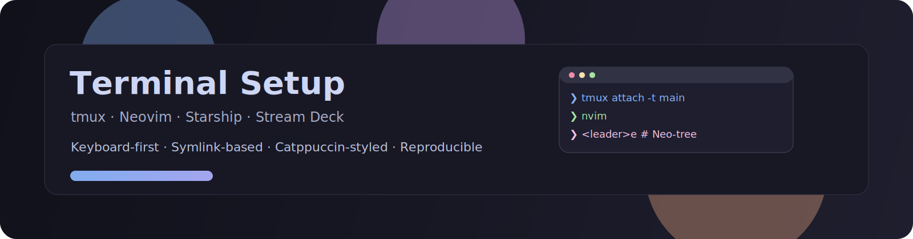
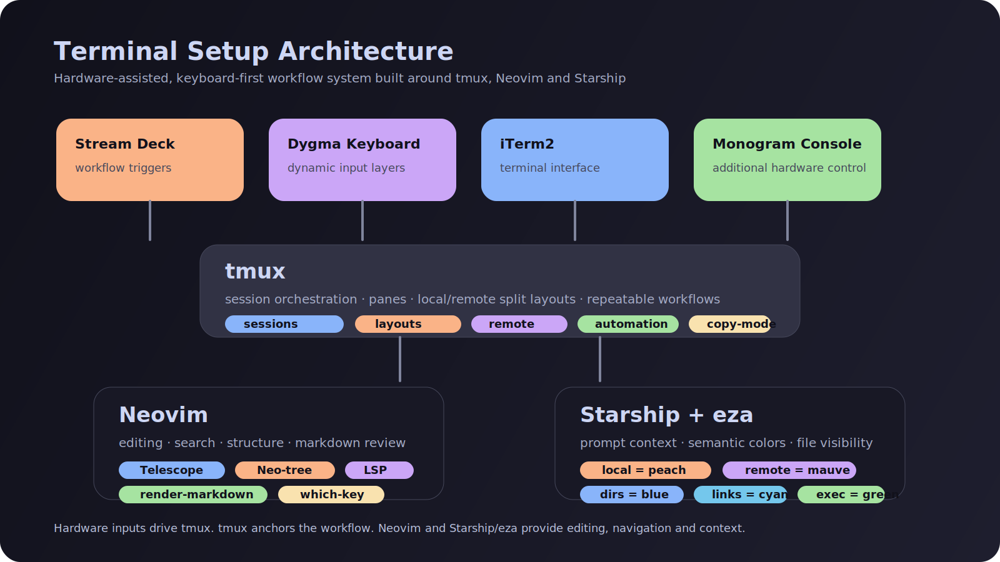
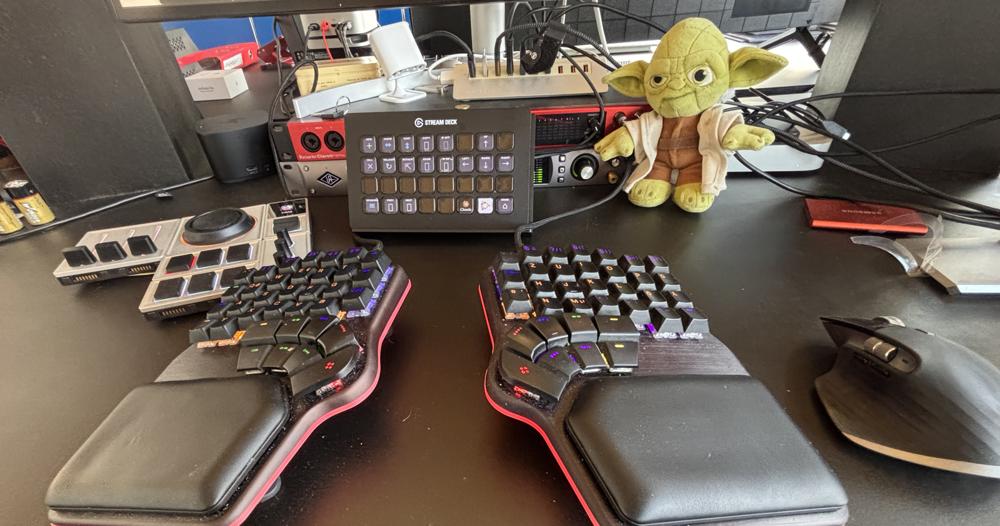
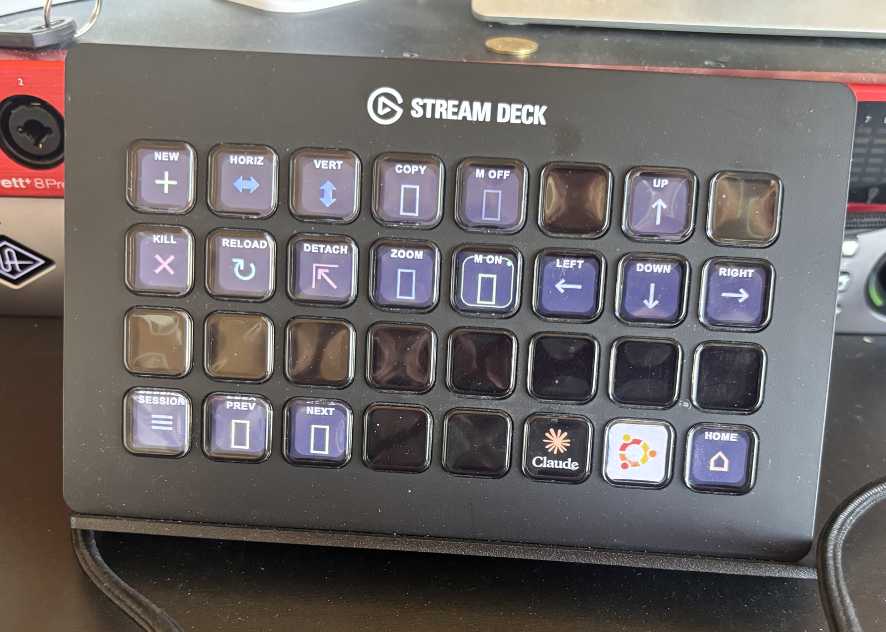
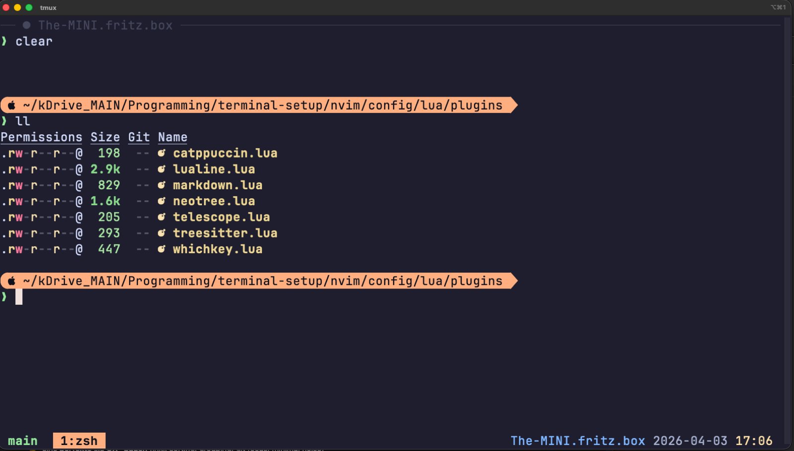
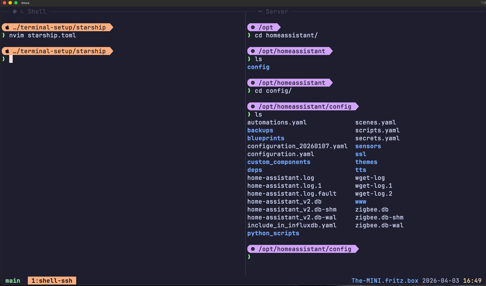
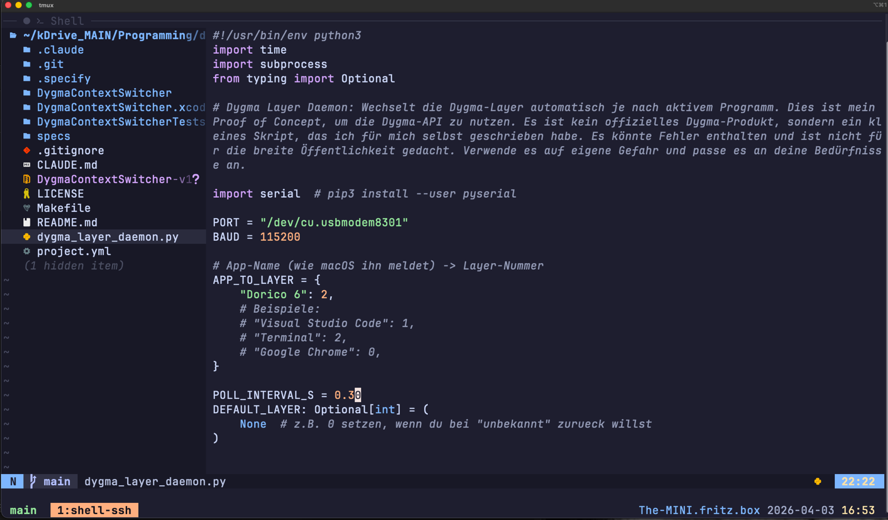
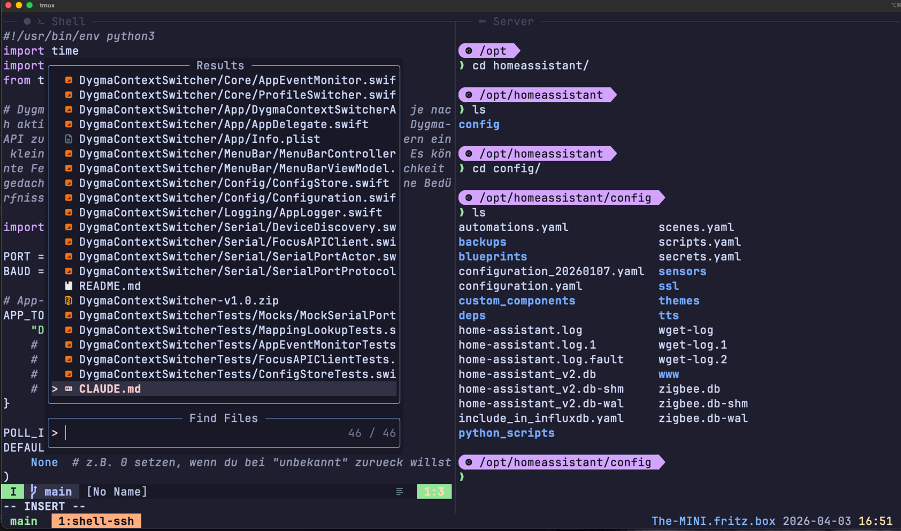

# ⚡ Terminal Setup


> Keyboard-first development environment with tmux, Neovim, Starship and hardware integration

---



---

## 🚀 Why this setup?

Most setups optimize tools — this one optimizes **flow**.

- minimal context switching  
- instant visual feedback  
- hardware + software as one system  
- reproducible on any machine  

---

## ⚡ Quickstart

```bash
git clone https://github.com/footprintsonthemoon/terminal-setup.git
cd terminal-setup
make bootstrap
```

---

## 🧭 Architecture



Layered system:

- Hardware → Stream Deck / Dygma / Monogram  
- tmux → orchestration  
- Neovim → editing  
- Starship → context  
- eza → file visibility  

---

## 🎨 Visual System

| Element | Meaning |
|--------|--------|
| Peach prompt | Local |
| Mauve prompt | Server |
| Blue | Directories |
| Cyan | Symlinks |
| Green | Executables |
| Grey | Files |

---

## ⌨️ Hardware





---

## 🖥️ Interface









---

## 📁 File UX (eza)

```bash
alias ls="eza -a --icons"
alias ll="eza -alh --icons"
alias la="eza -alh --icons"
alias lt="eza --tree --level=2"
```

---

## ⚙️ Prerequisites

- macOS  
- iTerm2 recommended  

Installed automatically:

- Homebrew  
- git  
- neovim  
- tmux  
- starship  
- eza  
- Nerd Font  

---

## 🚀 Installation

```bash
make bootstrap
```

---

## 🔤 Font Setup

Set in iTerm2:

JetBrainsMono Nerd Font

---

## 🛠️ Makefile

```bash
make bootstrap
make sync
make relink
make tmux
make nvim
```

---

## 🔗 Symlinks

~/.config/nvim → nvim/config  
~/.tmux.conf → tmux/.tmux.conf  
~/.config/starship.toml → starship/starship.toml  

---

## ⚠️ Troubleshooting

### SSH error

```bash
git clone https://github.com/footprintsonthemoon/terminal-setup.git
```

---

## 🔁 Updates

```bash
brew upgrade
make sync
```

---

## 🧠 Philosophy

Reduce friction. Increase flow.
